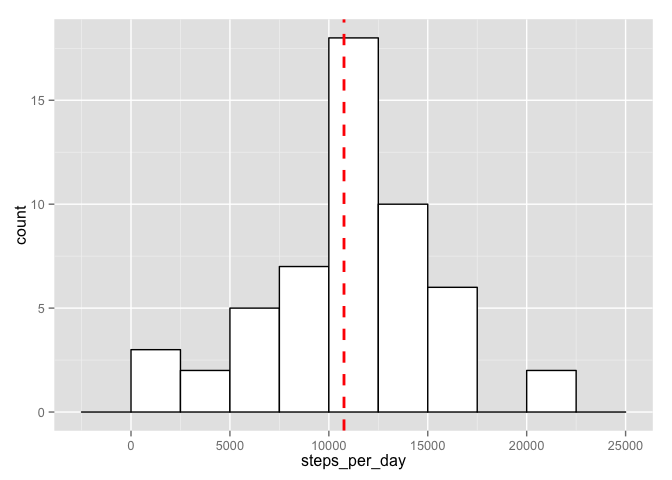
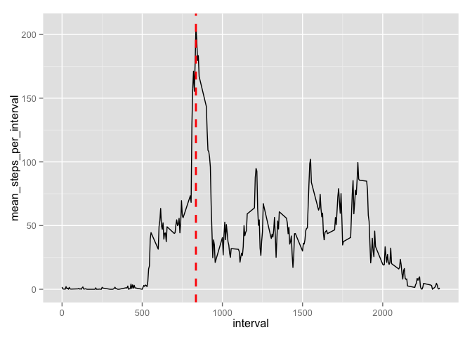
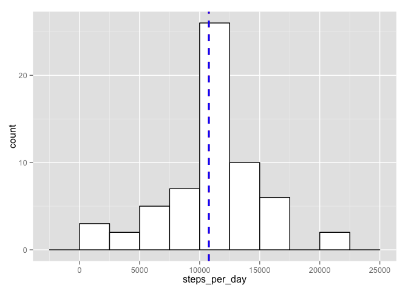
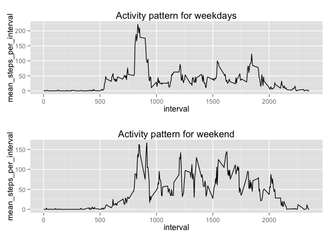

# Reproducible Research: Peer Assessment 1


## Loading and preprocessing the data

The data on the activity.csv file is the number of steps taken on each 5 minutes interval.  
Let's create a new dataframe containing the total number of steps per day.

```r
library(plyr)
library(ggplot2)
library(grid)
library(gridExtra)
options(scipen = 1, digits = 2) ## Remove scientific notation for variables.

data <- read.csv("activity.csv")
data_per_day <- ddply(data, ~date, summarise, steps_per_day = sum(steps)) 
head(data_per_day)
```

```
##         date steps_per_day
## 1 2012-10-01            NA
## 2 2012-10-02           126
## 3 2012-10-03         11352
## 4 2012-10-04         12116
## 5 2012-10-05         13294
## 6 2012-10-06         15420
```


## What is mean total number of steps taken per day?

Let's analyze this new dataframe by doing an histogram of the number of steps
taken each day.


```r
mean_steps <- mean(data_per_day$steps_per_day, na.rm = T)
median_steps <- median(data_per_day$steps_per_day, na.rm = T)

ggplot(data_per_day, aes(x = steps_per_day)) + geom_histogram(binwidth = 2500, colour ="black", fill = "white") + geom_vline(aes(xintercept = mean_steps), color = "red", linetype = "dashed", size = 1)
```

 

The mean number of steps taken per day by the anonymous individual is $\mu=$ 10766.19.  
The median number of steps taken per day by the anonymous individual is $m=$ 10765.

## What is the average daily activity pattern?

Let's now analyze how this individual distributes his steps during the day on 5 minute intervals.  
The steps are averaged for the whole two months.


```r
steps_per_interval <- ddply(data, ~interval, summarise, mean_steps_per_interval = mean(steps, na.rm = T))
head(steps_per_interval)
```

```
##   interval mean_steps_per_interval
## 1        0                   1.717
## 2        5                   0.340
## 3       10                   0.132
## 4       15                   0.151
## 5       20                   0.075
## 6       25                   2.094
```

Let's take a look at the plot for the mean steps per interval.


```r
max <- max(steps_per_interval$mean_steps_per_interval)
max_interval <- steps_per_interval$interval[which.max(steps_per_interval$mean_steps_per_interval)]

ggplot(steps_per_interval, aes(x = interval, y = mean_steps_per_interval)) + geom_line() + geom_vline(aes(xintercept = max_interval), color = "red", linetype = "dashed", size = 1)
```

 

The averaged interval with the most number of steps is the 835 interval, 
which corresponds to 8:35 a.m., with an average of 206.17 steps.  

## Imputing missing values

The data has some missing value in the number steps on some intervals.  

Let's count the number os entries that have missing values.


```r
missing_rows <- count(complete.cases(data))$freq[1]
```

The number of rows that have missing values is 2304.  

Let's use the mean number of steps for each interval to fill in those missing values.


```r
replace_w_mean <- function(x) replace(x, is.na(x), mean(x, na.rm = TRUE))
data2 <- ddply(data, ~interval, transform, steps = replace_w_mean(steps))
data2 <- data2[order(data2$date), ]
```

Let's take a look at this new dataframe in another histogram.

```r
data_per_day2 <- ddply(data2, ~date, summarise, steps_per_day = sum(steps)) 
mean_steps2 <- mean(data_per_day2$steps_per_day, na.rm = T)

ggplot(data_per_day2, aes(x = steps_per_day)) + geom_histogram(binwidth = 2500, colour ="black", fill = "white") + geom_vline(aes(xintercept = mean_steps2), color = "red", linetype = "dashed", size = 1) + geom_vline(aes(xintercept = mean_steps), color = "blue", linetype = "dashed", size = 1)
```

 

Since the values we're imputing replacing NAs values are the mean steps for that interval, the mean steps per day is still the same, but the count for this histogram changed for some of the intervals of the steps per day. Before we discarded the days with some NAs value, so there were less days to count. We're replacing those values with the mean, so now we can count those days in our data, and they make the height of the boxes in the histogram taller.

## Are there differences in activity patterns between weekdays and weekends?

Now let's analyze the activity patterns during weekdays and during weekends.


```r
data2$date <- as.Date(data2$date)
data2 <- data.frame(data2, "weekday" = weekdays(data2$date))
weekdays = c("Monday", "Tuesday","Wednseday", "Thursday", "Friday")
weekend = c("Saturday", "Sunday")
data2_weekday <- subset(data2, weekday %in% weekdays)
data2_weekend <- subset(data2, weekday %in% weekend)

steps_per_interval_day <- ddply(data2_weekday, ~interval, summarise, mean_steps_per_interval = mean(steps, na.rm = T))
steps_per_interval_end <- ddply(data2_weekend, ~interval, summarise, mean_steps_per_interval = mean(steps, na.rm = T))

p1 <- ggplot(steps_per_interval_day, aes(x = interval, y = mean_steps_per_interval)) + geom_line() + ggtitle("Activity pattern for weekdays")
p2 <- ggplot(steps_per_interval_end, aes(x = interval, y = mean_steps_per_interval)) + geom_line() + ggtitle("Activity pattern for weekend")

grid.arrange(p1, p2, ncol=1)
```

 

We can clearly see that the activity during the weekend is higher than during weekdays.
